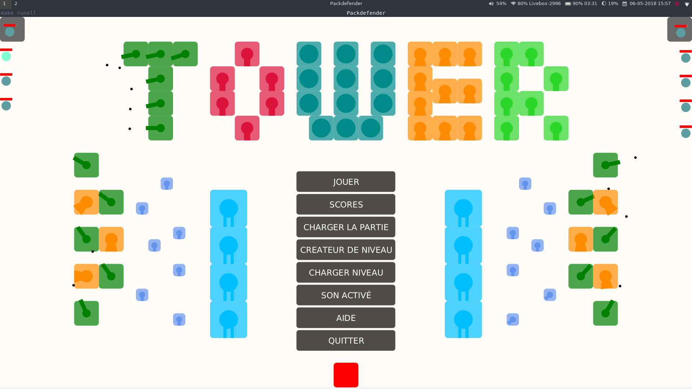

# TowerDefense
A TowerDefense game realized as a semester project at Paris Diderot University.

# Installation
```
$ git clone https://github.com/gostreap/TowerDefense.git 
```
Then to compile :
```
$ cd TowerDefense
$ make
```
And to run the game :
```
$ make run
```
If you want to compile and run at once :
```
$ make runAll
```
Finally to clean the compiled files :
```
$ make fclean
```

# Pictures


